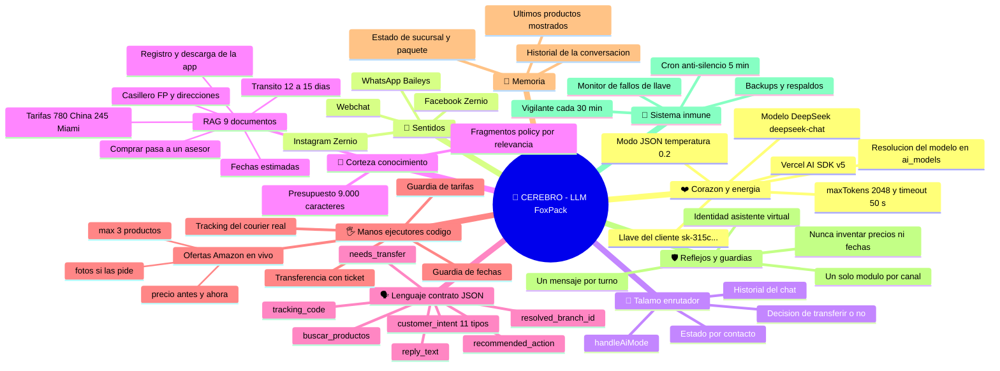
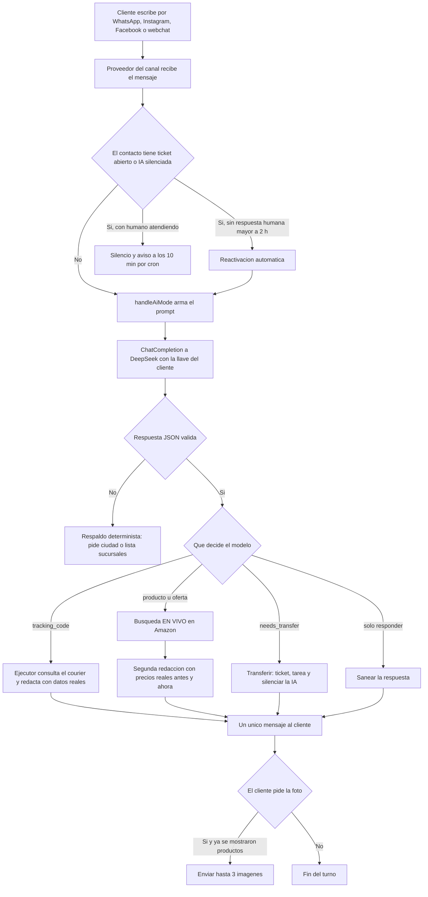

> Documentación del **asistente IA de FoxPack Courier** dentro de AllSender.
> Repo de conocimiento (no contiene código desplegado: el código vive en el servidor).

---

# 🧠 AllSender · LLM de FoxPack

El asistente de FoxPack es un **LLM (DeepSeek `deepseek-chat`) que vive dentro del "branch router"** de la
plataforma AllSender (`wapi-api`). Recibe el mensaje del cliente, se le arma un **prompt grande**
(identidad + sucursales + conocimiento del negocio + reglas + fecha del día), responde **un JSON de
contrato** y el servidor **ejecuta** lo que ese JSON decide: responder, consultar un tracking real,
transferir a una sucursal o buscar ofertas en Amazon en el momento.

> **Idea central:** el modelo **entiende y redacta**; el código **verifica y ejecuta**.
> Así los precios, los estados de paquete y las fechas nunca se inventan.

---

## 1. 🧠 Mapa mental (el cerebro del asistente)



---

## 2. El cerebro, pieza por pieza

| Metáfora | Qué es de verdad | Dónde vive |
| --- | --- | --- |
| ❤️ Corazón | Llave del cliente + modelo + SDK | `user_settings.api_key`, `services/omnicall.service.js` |
| 👀 Sentidos | Los 4 canales de entrada | Baileys (WhatsApp), Zernio (IG/FB), webchat |
| 🧭 Tálamo | Enrutador que decide el camino | `services/branch-router.service.js` → `handleAiMode` |
| 🧠 Corteza | Conocimiento del negocio (RAG) | `omnichannel_branch_knowledge` + `knowledge-retrieval.service.js` |
| 🗣️ Lenguaje | El contrato JSON del modelo | prompt + `parseJsonSafely` |
| 🖐️ Manos | Ejecutores deterministas | `foxpack-tracking.service.js`, `amazon-deals-live.service.js` |
| 💾 Memoria | Historial + último estado por chat | `omnichannel_branch_conversation_states`, `messages` |
| 🛡️ Reflejos | Guardias y reglas de oro | `branch-router.service.js` (bloques de saneado) |
| 🦴 Sistema inmune | Vigilantes y cron | tarea cada 30 min, `scripts/aviso-silencio.mjs` |

---

## 3. El viaje de un mensaje



---

## 4. Cómo se construye la consulta al modelo

**Archivo:** `services/branch-router.service.js` (se arma en la línea ~1028 y se ejecuta en la ~1040).

### 4.1 El prompt del sistema (orden exacto)

```js
const systemPromptFinal =
    systemPrompt                                  // identidad + matriz + 38 sucursales + reglas del negocio
  + customerContextPrompt(contactDoc)             // ficha del cliente
  + (candidatasDeZona.length > 1 ? '=== ZONA CON VARIOS PUNTOS (OBLIGATORIO) === ...' : '')
  + bloquePaqueteRecordado                        // si ya se habló de un paquete
  + bloqueSucursalDetectada                       // si la sucursal ya está determinada
  + (knowledgeContext ? '\n\n' + knowledgeContext : '')   // RAG (hasta 9.000 caracteres)
  + responseStyleContract                         // estilo obligatorio
  + bloqueOfertasAmazon                           // reglas de productos y fotos (solo FoxPack)
  + bloqueFechaHoy;                               // fecha real de RD
```

Tamaños medidos en producción (`[BranchRouter] Prompt:`):

| Bloque | Tamaño típico |
| --- | --- |
| Prompt completo | **~35.000 caracteres** (~9.700 tokens) |
| Conocimiento (RAG) | ~10.300 caracteres |
| Sucursales (`branchesJson`) | ~6.800 caracteres (recortado desde 11.028) |
| Historial del chat | ~50–300 caracteres |

### 4.2 La llamada real

```js
const omniResult = await omnicallService.chatCompletion({
  systemPrompt: systemPromptFinal,
  messages: conversationMessages,        // historial + mensaje entrante
  jsonMode: true,                        // respuesta SOLO JSON
  temperature: 0.2,
  preferredProvider: userSetting?.ai_model?.provider || null,
  preferredModel:    userSetting?.ai_model?.model_id || null,
  preferredBaseUrl:  userSetting?.ai_model?.api_endpoint || null,
  customApiKey:      userSetting?.api_key || null,   // llave DEL CLIENTE
  userId: ownerUserId,
  fallbackChain: userSetting?.api_key
    ? [{ provider: 'deepseek', model: 'deepseek-chat', apiKey: userSetting.api_key }]
    : []                                             // sin llave la cola queda vacía y cae al respaldo
});
```

---

## 5. El contrato JSON

| Campo | Qué significa |
| --- | --- |
| `customer_intent` | `SALES`, `SUPPORT`, `COMPLAINT`, `BILLING`, `ORDER`, `PRODUCT_INFORMATION`, `STOCK_CHECK`, `HUMAN_REQUEST`, `GENERAL_INFORMATION`, `GREETING`, `UNKNOWN` |
| `reply_text` | Texto que verá el cliente |
| `resolved_branch_id` | Sucursal elegida o `null` |
| `needs_transfer` | Pasar el caso a una persona |
| `tracking_code` | Dispara el ejecutor del courier |
| `buscar_productos` | (en pruebas) lo que busca el cliente, o `null` |
| `recommended_action` | Qué haría el router después |

---

## 6. Conocimiento (RAG)

- Colección `omnichannel_branch_knowledge`, **9 documentos**, `scope: workspace` (los heredan las 38 sucursales).
- Los `type: "policy"` **se inyectan siempre**; el resto entra por relevancia (TF-IDF, presupuesto 9.000 chars).
- Contenido clave: **China RD$780/libra**, **Miami RD$245/libra**, **tránsito 12–15 días con salida los viernes**, casillero **FP-XXXX**, direcciones Miami/China, registro `courier.foxpack.us/registration` + app `bit.ly/descargafoxpack`, **comprar = registrarse y pasar a un asesor**, regla de **fechas estimadas**.

---

## 7. Reglas de oro (no romper)

1. **Un solo módulo activo por canal**: el LLM nunca altera pedidos ni precios calculados por el ejecutor.
2. **Un mensaje por turno** (el acuse de handoff se marca como enviado).
3. **Identidad:** "asistente virtual de FoxPack Courier", nunca el nombre de una persona del equipo.
4. **Nunca inventar**: precios y stock solo desde el ejecutor; fechas siempre estimadas.
5. **Solo FoxPack** en la búsqueda de ofertas (`AMAZON_LIVE_WORKSPACE`).
6. **No tocar la capa del modelo sin probarla aparte**: `jsonMode` + herramientas nativas de DeepSeek **no son compatibles** (rompió el flujo entero el 2026-10-06).

---

## 8. Qué falta por mejorar (backlog)

| # | Mejora | Por qué | Impacto | Esfuerzo |
| --- | --- | --- | --- | --- |
| 1 | **Modo autónomo por contrato**: el modelo decide buscar con el campo `buscar_productos` (sin listas de palabras) | Hoy las listas fallan con frases no previstas (*"Fire tv stikw"* → no busca) | Alto | Medio (probar aislado primero) |
| 2 | **Vigilante dentro del servidor**: si hay 3 fallos de llave en 15 min o el puerto no responde, reinicia solo y lo registra | Evita repetir el incidente de 4 días cayendo al texto fijo | Alto | Bajo |
| 3 | **Búsqueda por embeddings** en vez de TF-IDF | Recupera mejor cuando el cliente usa otras palabras | Medio | Medio |
| 4 | **Contador persistente de tickets** | Hoy el último número se reusa al borrar un ticket | Medio | Bajo |
| 5 | **Batería de pruebas de regresión** (los casos reales que fallaron) | Fija lo aprendido y evita reintroducir errores | Alto | Medio |
| 6 | **Recortar más el prompt** (sucursales por zona, no las 38 siempre) | Menos coste y más espacio para conocimiento | Medio | Bajo |
| 7 | **Experimentos A/B de prompts** con métrica (resueltos por IA vs transferidos) | Decisiones con datos, no por intuición | Medio | Medio |
| 8 | **Memoria de largo plazo por cliente** (resumen acumulado) | Conversaciones largas sin repetir contexto | Medio | Medio |
| 9 | **Ruido del log de Zernio** | Limpieza operativa | Bajo | Bajo |
| 10 | **Activar para más clientes** (hoy solo FoxPack) | Escalar el producto | Alto | Bajo (aislar por workspace) |

---

## 9. Infraestructura y diagnóstico

| Pieza | Dónde |
| --- | --- |
| App | `/www/wwwroot/wapi-api` · PM2 `wapi-api` · puerto 5100 |
| Base de datos | MongoDB en Docker (`wapi-mongodb`), base `wapi` |
| Front del chat | `/www/wwwroot/wapi-frontend` · `platform.allsender.tech/wa_chat` |
| Firecrawl (solo si Amazon bloquea) | `FIRECRAWL_API_KEY` en `.env` de `wapi-api` |
| Cron anti-silencio | cada 5 min (`scripts/aviso-silencio.mjs`) |

Marcadores útiles del log:

```
[BranchRouter] Prompt: 35.037 chars (~9.733 tokens) | conocimiento=… | sucursales=… | historial=…
[AI SDK HTTP] provider: 'deepseek' status: 200
[BranchRouter AI Mode] Response via Omnicall (deepseek/deepseek-chat): { … }
[BranchRouter] Tracking FoxPack: estado=Entregado
[AmazonLive] query="fire tv" provider=direct parseados=16 validos=15 devueltos=3 ms=1028 creditos=0
[BranchRouter] Fotos de ofertas enviadas: 3
[BranchRouter AI Mode] Tenant provider failed; platform key is not used     ← vigilar (error.log)
```

---

## 10. Contenido de este repo

```
README.md                        ← este documento (cerebro + consulta + backlog)
docs/01-mapa-mental-llm.md       ← mapa mental y flujo completos, con detalle por bloque
docs/02-chat-wa-fixes.md         ← arreglos del chat (audio, texto, ortografía local)
docs/03-historial-incidentes.md  ← los fallos reales y cómo se resolvieron
llm/README.md                    ← código aislado: qué es cada archivo y cómo montarlo
llm/wapi-api/…                   ← el código del LLM y sus funciones (snapshot 2026-10-07)
```

---

## 11. Código aislado del LLM (`llm/`)

Snapshot del **2026-10-07** con **solo** el código del LLM y sus funciones, extraído aparte porque el resto
de la aplicación tiene cambios fuera del SaaS. Ver el detalle en [`llm/README.md`](llm/README.md).

| Archivo | Rol |
| --- | --- |
| `services/branch-router.service.js` | **El cerebro**: prompt, llamada al modelo, contrato JSON y ejecución |
| `services/omnicall.service.js` | **Capa del modelo**: AI SDK, modo JSON, cadena de respaldo |
| `services/amazon-deals-live.service.js` | **Ofertas en vivo** (Prime, oferta, ≤ US$199, máx. 3, antes/ahora) |
| `services/foxpack-tracking.service.js` | **Tracking real** del courier |
| `services/knowledge-retrieval.service.js` | **RAG**: conocimiento del negocio (9.000 chars, `policy` primero) |
| `services/handoff-ack.service.js` | Acuse al pasar a una persona (con candado de un mensaje por turno) |
| `services/conversation-context.service.js` | Contexto de conversación y aviso de ticket abierto |
| `services/deepseek.service.js` | Cliente directo de DeepSeek (auxiliar) |
| `utils/response-style-policy.js` | Saneado y estilo de las respuestas |
| `utils/ai-utils.js` | Utilidades de IA compartidas |
| `scripts/aviso-silencio.mjs` | Cron anti-silencio (cada 5 min, soporta `--dry`) |

**Verificado antes de publicar:** ningún archivo contiene claves, tokens, contraseñas, teléfonos ni correos.
Las claves viven en `.env` del servidor y en `user_settings` del cliente.

---

## Licencia

Código y documentación **propiedad de CodeMorf / cliente FoxPack**. Ver `LICENSE`.
Si se quiere publicar como open source, sustituir por MIT o Apache-2.0.

