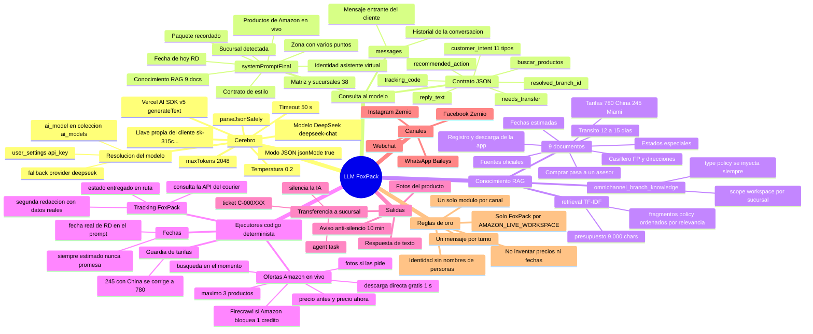
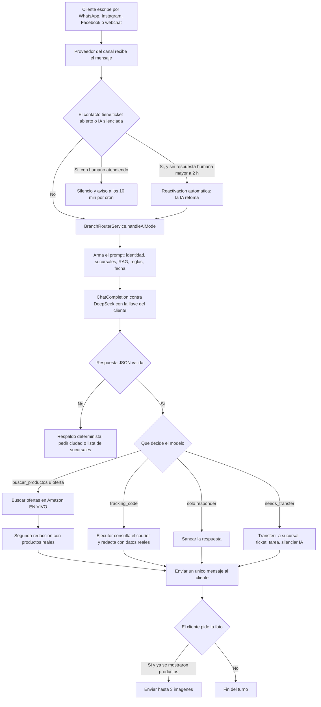

# FoxPack · El LLM del asistente: cómo está hecho y mapa mental completo

Documento técnico (2026-10-07). Servidor `root@86.48.20.221` (S2) · App `/www/wwwroot/wapi-api` (PM2 `wapi-api`, puerto 5100) · Front `platform.allsender.tech` (`/www/wwwroot/wapi-frontend`).

---

## 1. Resumen en una frase

El asistente de FoxPack es un **LLM (DeepSeek `deepseek-chat`) que corre dentro del “branch router”** de
`wapi-api`: recibe el mensaje del cliente, se le arma un **prompt grande** (identidad + sucursales +
conocimiento del negocio + reglas + fecha), responde **un JSON de contrato** y el servidor **ejecuta** lo que
ese JSON decide (responder, consultar un tracking, transferir a una sucursal, buscar ofertas en Amazon).
El modelo **decide y redacta**; el código **verifica y ejecuta**.

---

## 2. Mapa mental completo



---

## 3. El viaje de un mensaje (de punta a punta)



---

## 4. Cómo se construye la consulta al modelo (línea por línea)

**Dónde**: `services/branch-router.service.js`, dentro de `handleAiMode` (la consulta se arma en la línea ~1028 y se ejecuta en la ~1040).

### 4.1 El prompt del sistema (se concatena en este orden exacto)

```js
const systemPromptFinal =
    systemPrompt                                  // identidad + matriz + sucursales + reglas del negocio
  + customerContextPrompt(contactDoc)             // ficha del cliente (nombre, teléfono, datos)
  + (candidatasDeZona.length > 1 ? '=== ZONA CON VARIOS PUNTOS (OBLIGATORIO) === ...' : '')  // si la zona tiene varios puntos: lista numerada, prohibido elegir
  + bloquePaqueteRecordado                        // si ya se habló de un paquete en este chat
  + bloqueSucursalDetectada                       // si la sucursal ya está determinada
  + (knowledgeContext ? '\n\n' + knowledgeContext : '')  // RAG del negocio (hasta 9.000 caracteres)
  + responseStyleContract                         // estilo obligatorio: tono, formato, qué no hacer
  + bloqueOfertasAmazon                           // reglas de productos y fotos (solo FoxPack)
  + bloqueFechaHoy;                               // “FECHA DE HOY: martes, 6 de octubre de 2026 (RD)”
```

Tamaño típico medido en producción (log `[BranchRouter] Prompt:`):

| Bloque | Tamaño típico |
| --- | --- |
| Prompt completo | **~35.000 caracteres** (~9.700 tokens) |
| Conocimiento (RAG) | ~10.300 caracteres |
| Sucursales (`branchesJson`) | ~6.800 caracteres (recortado desde 11.028) |
| Historial de la conversación | ~50–300 caracteres |

### 4.2 El historial (`messages`)

```js
const conversationMessages = historyMessages…        // turnos previos de ESTE chat
conversationMessages.push({ role: 'user', content: String(incomingText) });
```

### 4.3 La llamada real (parámetros exactos)

```js
const omniResult = await omnicallService.chatCompletion({
  systemPrompt: systemPromptFinal,
  messages: conversationMessages,
  jsonMode: true,                                   // respuesta SOLO JSON
  temperature: 0.2,                                 // estable, poca creatividad
  preferredProvider: userSetting?.ai_model?.provider || null,
  preferredModel:    userSetting?.ai_model?.model_id || null,
  preferredBaseUrl:  userSetting?.ai_model?.api_endpoint || null,
  customApiKey:      userSetting?.api_key || null,   // llave DEL CLIENTE
  userId: ownerUserId,
  fallbackChain: userSetting?.api_key
    ? [{ provider: 'deepseek', model: 'deepseek-chat', apiKey: userSetting.api_key, baseUrl: … }]
    : []                                             // si no hay llave, la cola queda vacía y cae al respaldo
});
```

Dentro de `services/omnicall.service.js`: se normaliza la base URL (quita `/chat/completions`), se crea el
proveedor con el AI SDK, `generateText({ model, messages, temperature, maxOutputTokens, abortSignal: 50 s,
maxRetries: 2 })`, y se devuelve `{ success, json, text, provider, model, errors }`.

> **Regla aprendida**: si `api_key` no se resuelve, la cola va vacía y el router **cae al respaldo fijo**
> (`[BranchRouter AI Mode] Tenant provider failed`). Es el fallo que dejó a FoxPack 4 días contestando
> textos fijos hasta que se reinició el proceso.

---

## 5. El contrato JSON que devuelve el modelo

| Campo | Qué significa |
| --- | --- |
| `customer_intent` | Taxonomía: `SALES`, `SUPPORT`, `COMPLAINT`, `BILLING`, `ORDER`, `PRODUCT_INFORMATION`, `STOCK_CHECK`, `HUMAN_REQUEST`, `GENERAL_INFORMATION`, `GREETING`, `UNKNOWN` |
| `reply_text` | El texto que verá el cliente (sale tal cual, tras saneado y guardias) |
| `resolved_branch_id` | La sucursal elegida, o `null` si aún no se sabe |
| `needs_transfer` | Si hay que pasar el caso a una persona |
| `tracking_code` | Código de rastreo detectado → dispara el ejecutor del courier |
| `buscar_productos` | (Modo autónomo en pruebas) lo que busca el cliente, o `null` |
| `recommended_action` | Qué haría el router a continuación |
| `customer_branch_detected`, `customer_city`, `confidence`… | Datos de apoyo para la decisión |

---

## 6. El conocimiento (RAG) que recibe el modelo

- Colección `omnichannel_branch_knowledge`, **9 documentos** de FoxPack, `scope: workspace` (los heredan las 38 sucursales).
- Tipos: los `type: "policy"` (tarifas, tránsito, casillero, registro/compra, fechas estimadas…) **se inyectan siempre**; el resto entra por relevancia.
- `services/knowledge-retrieval.service.js`: trocea en fragmentos (~1.100 chars), puntúa por TF-IDF contra el mensaje, presupuesto **9.000 caracteres**, y los `policy` van **ordenados por relevancia** (antes iban por orden de carga y un documento nuevo podía quedar fuera).
- Contenido clave: **China RD$780/libra**, **Miami RD$245/libra**, **tránsito 12–15 días con salida los viernes**, casillero **FP-XXXX**, direcciones de Miami y China, **registro** `courier.foxpack.us/registration` + app `bit.ly/descargafoxpack`, **comprar = registrarse y pasar a un asesor**, regla de **fechas estimadas**, y “la tarifa incluye impuestos del flete, no los aduanales de productos sobre US$200”.

---

## 7. Los ejecutores (el código que verifica)

| Ejecutor | Cuándo actúa | Qué hace |
| --- | --- | --- |
| `foxpack-tracking.service.js` | El modelo devuelve `tracking_code` | Consulta la API del courier, obtiene estado real y hace una **segunda redacción** con datos reales |
| `amazon-deals-live.service.js` | El cliente pide productos u ofertas (solo FoxPack) | Descarga Amazon con filtros Prime + oferta + ≤ US$199, **parsea el HTML en local** (sin IA), devuelve **máx. 3** con precio antes/ahora; Firecrawl solo si Amazon bloquea |
| Guardia de tarifas | Cualquier respuesta que mencione China y 245/244.99 | Lo corrige a **780** antes de enviar (los precios son dinero) |
| Guardia de fechas | Siempre | Inyecta la fecha real de RD y prohíbe prometer fechas |
| `executeBranchTransfer` | `needs_transfer` con sucursal | Crea el ticket `C-000XXX`, la tarea del agente, silencia la IA y marca el acuse como ya enviado (**un solo mensaje por turno**) |
| `enviarImagenesOfertas` | El cliente pide la foto y ya se mostraron productos | Envía hasta 3 imágenes (`messageType: 'image'` + `mediaUrl`) |
| Cron `scripts/aviso-silencio.mjs` | Cada 5 min | Si un caso lleva >10 min sin respuesta humana y el cliente espera, le avisa (máx. 2 veces) |

---

## 8. Reglas de oro (no romper)

1. **Un solo módulo activo por canal**: el LLM nunca altera pedidos ni precios calculados por el ejecutor.
2. **Un mensaje por turno** (el acuse de handoff se marca como enviado).
3. **Identidad**: se presenta como “asistente virtual de FoxPack Courier”, nunca con el nombre de una persona.
4. **Nunca inventar**: precios y disponibilidad solo desde el ejecutor; fechas siempre estimadas.
5. **Solo FoxPack** en la búsqueda de ofertas (`AMAZON_LIVE_WORKSPACE`).
6. **No tocar la capa del modelo sin probarla aparte**: `jsonMode` + herramientas nativas de DeepSeek **no son compatibles** (rompió todo el flujo el 2026-10-06).

---

## 9. Configuración e infraestructura

| Pieza | Dónde |
| --- | --- |
| App | `/www/wwwroot/wapi-api` · PM2 **`wapi-api`** · puerto **5100** |
| Base de datos | MongoDB en Docker (`wapi-mongodb`), base `wapi` (URI en `.env`, puerto 27018 fuera del contenedor) |
| Llave del cliente | `user_settings.api_key` del dueño (`info@foxpack.us`) |
| Modelo | `ai_models` (colección de migración) + catálogo `aimodels` |
| Firecrawl (solo si Amazon bloquea) | `FIRECRAWL_API_KEY` en `.env` de `wapi-api` |
| Cron anti-silencio | `*/5 * * * * … scripts/aviso-silencio.mjs` (log en `/var/log/aviso-silencio.log`) |
| Vigilante de salud | tarea cada 30 min (proceso, puerto, fallos de llave, textos fijos a clientes) |

**Marcadores de log para diagnosticar** (`/root/.pm2/logs/wapi-api-out.log` y `-error.log`):

```
[BranchRouter] Prompt: 35.037 chars (~9.733 tokens) | conocimiento=… | sucursales=… | historial=…
[AI SDK HTTP] provider: 'deepseek' status: 200
[BranchRouter AI Mode] Response via Omnicall (deepseek/deepseek-chat): { … }
[BranchRouter] Tracking FoxPack: estado=Entregado | requiere_persona=-
[AmazonLive] query="fire tv" provider=direct html=… parseados=16 validos=15 devueltos=3 ms=1028 creditos=0
[BranchRouter] Fotos de ofertas enviadas: 3
[BranchRouter] Transfer finalized … ticket=C-000XXX
[BranchRouter] Blindaje de coherencia: claimsAssignment forzo transferencia …     ← vigilar
[BranchRouter AI Mode] Tenant provider failed; platform key is not used          ← vigilar (sale en error.log)
```

---

## 10. Historial de fallos reales y cómo quedaron

| Fallo | Causa | Arreglo |
| --- | --- | --- |
| 4 días contestando textos fijos | El proceso dejó de resolver la llave del tenant | **Reinicio** + vigilante; hoy sigue estable |
| Conversaciones “aparcadas” por una frase inocente | El blindaje se activaba con `tu caso` | Disparador acotado + solo transfiere si el caso lo pide |
| Silencio eterno tras transferir | La IA quedaba muda sin retorno | **Reactivación automática a las 2 h** + aviso a los 10 min |
| Fotos prometidas y no enviadas | `last_offers` no se guardaba (Mongoose descartaba el campo) + prioridad mal ordenada | Guardado con el driver + la foto de lo mostrado tiene prioridad |
| **TV de 50" a US$7** | El parser leía el primer número suelto de la tarjeta | Precio desde el contenedor `a-price` + se descartan descuentos >85 % |
| Fecha inventada (“30 de septiembre”) | El prompt no llevaba la fecha | `bloqueFechaHoy` con la fecha real de RD |
| Búsquedas basura (`day`, `saber`, `estoy esperando`) | Se buscaba con cualquier palabra | Filtro de palabras vacías + palabras cortas de producto (tv, pc, usb…) |
| Herramientas nativas rompieron el flujo | DeepSeek no acepta `tools` + modo JSON | Revertido; el modo autónomo va por **campo del contrato**, con prueba aislada |

---

## 11. Pendientes abiertos

1. **Modo autónomo por contrato** (que el modelo decida buscar sin listas de palabras): probar aislado, campo `buscar_productos` como única vía, y solo entonces apagar las listas.
2. **Vigilante dentro del servidor** (reinicio automático si detecta 3 fallos de llave en 15 min).
3. **Contador persistente de tickets** (hoy se reusa el último número al borrarlo).
4. **Ruido del log de Zernio** (“No connected account mapped…”).
5. Ampliar la lista de palabras de producto frecuentes mientras llega el modo autónomo.
